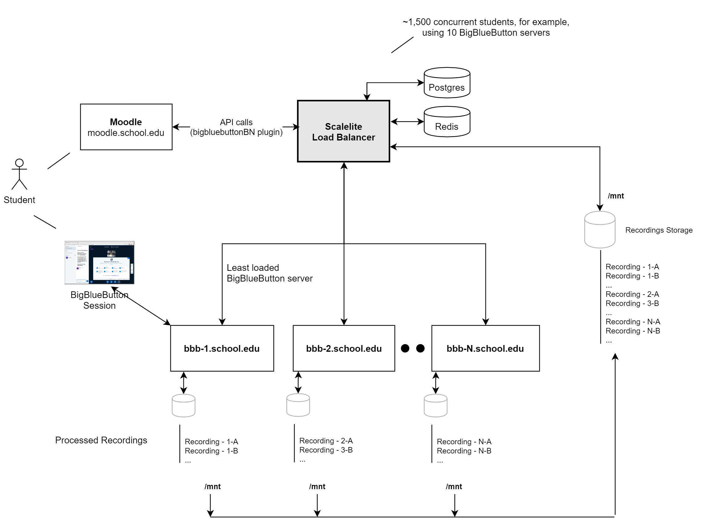

# Scalelite

[BigBlueButton](https://docs.bigbluebutton.org/) is an open source web conferencing system for online learning.

Scalelite is an open source load balancer that manages a pool of BigBlueButton servers.  It makes the pool of servers appear as a (very scalable) BigBlueButton.  A front-end, such as [Moodle](https://moodle.org/plugins/mod_bigbluebuttonbn) or [Greenlight](https://github.com/bigbluebutton/greenlight), sends standard BigBlueButton API requests to the Scalelite server which, in turn, distributes those request to the least loaded BigBlueButton server in the pool.

A single BigBlueButton server that meets the [minimum configuration](http://docs.bigbluebutton.org/2.2/install.html#minimum-server-requirements) supports around 200 concurrent users.

For many schools and organizations, the ability to 4 simultaneous classes of 50 users, or 8 simultaneous meetings of 25 users, is enough capacity.  However, what if a school wants to support 1,500 users across 50 simultaneous classes?  A single BigBlueButton server cannot handle such a load.

With Scalelite, a school can create a pool of 4 BigBlueButton servers and handle 16 simultaneous classes of 50 users.  Want to scale higher, add more BigBlueButton servers to the pool.

BigBlueButton has been in development for over 10 years now.  The latest release is a pure HTML5 client, with extensive documentation.  There is even a BigBlueButton install script called [bbb-install.sh](https://github.com/bigbluebutton/bbb-install) that lets you setup a BigBlueButton server (with a Let's Encrypt certificate) in about 15 minutes.  Using `bbb-install.sh` you can quickly setup a pool of servers for management by Scalelite.

To load balance the oool, Scalelite periodically polls each BigBlueButton to check if it is reachable online, ready to receive [API](http://docs.bigbluebutton.org/dev/api.html) requests, and to determine its current load (number of connected users).  With this information, when Scalelite receives an incoming API call to [create](http://docs.bigbluebutton.org/dev/api.html#create) a new meeting, it places the new meeting on the least loaded server in the pool.   In this way, Scalelite can balance the load of meeting requests evenly across the pool.

Many BigBlueButton servers will create many recordings.  Scalelite can serve a large set of recordings by consolidating them together, indexing them in a database, and, when receiving an incoming [getRecordings](https://docs.bigbluebutton.org/dev/api.html#getrecordings), use the database index to return quickly the list of available recordings.

## Before you begin

The Scalelite installation process requires advanced technical knowledge.  You should, at a minimum, be very familar with
  
   * Setup and administration of a BigBlueButton server
   * Setup and administration of a Linux server and using common tools, such as `systemd`, to manage processes on the server
   * How the [BigBlueButton API](http://docs.bigbluebutton.org/dev/api.html) works with a front-end
   * How [docker](https://www.docker.com/) containers work 
   * How UDP and TCP/IP work together
   * How to administrate a Linux Firewall
   * How to setup a TURN server
   
If you are a beginner, you will have a difficult time getting any part of this deployment correct.  If you require help, see [Getting Help](#getting-help)

## Architecture of Scalelite

There are several components required to get Scalelite up and running:

1. Multiple BigBlueButton Servers
2. Scalelite LoadBalancer Server
3. NFS Shared Volume
4. PostgreSQL Database
5. Redis Cache 

An example Scalelite deployment will look like this:



### Setup a pool of BigBlueButton Server

To setup a pool of BigBlueButton servers (minimum recommended number is 3), we recommend using [bbb-install.sh](https://github.com/bigbluebutton/bbb-install) as it can automate the steps to install, configure (with SSL + Let's Encrypt), and update the server when [new versions](https://github.com/bigbluebutton/bigbluebutton/releases) of BigBlueButton are released.

To help users who are behind restrictive firewalls to send/receive media (audio, video, and screen share) to your BigBlueButton server, you should setup a TURN server and configure each BigBlueButton server to use it.

Again, [bbb-install.sh](https://github.com/bigbluebutton/bbb-install#install-a-turn-server) can automate this process for you.

### Setup a shared volume for recordings

See [Setting up a shared volume for recordings](sharedvolume-README.md)

### Setup up a PostgreSQL Database

Setting up a PostgreSQL Database depends heavily on the infrastructure you use to setup Scalelite. We recommend you refer to your infrastructure provider's documentation.

Ensure the `DATABASE_URL` that you set in `/etc/default/scalelite` (in the [next step](docker-README.md#common-configuration-for-docker-host-system)) matches the connection url of your PostgreSQL Database. 

For more configuration options, see [configuration](#Configuration).

### Setup a Redis Cache

Setting up a Redis Cache depends heavily on the infrastructure you use to setup Scalelite. We recommend you refer to your infrastructure provider's documentation.

Ensure the `REDIS_URL` that you set in `/etc/default/scalelite` (in the [next step](docker-README.md#common-configuration-for-docker-host-system)) matches the connection url of your Redis Cache. 

For more configuration options, see [configuration](#Configuration).

### Deploying Scalelite Docker Containers

See [Deploying Scalelite Docker Containers](docker-README.md)

## Configuration

### Environment Variables

#### Required

* `URL_HOST`: The hostname that the application API endpoint is accessible from. Used to protect against DNS rebinding attacks.
* `SECRET_KEY_BASE`: A secret used internally by Rails. Should be unique per deployment. Generate with `rake secret`.
* `LOADBALANCER_SECRET`: The shared secret that applications will use when calling BigBlueButton APIs on the load balancer. Generate with `openssl rand -hex 32`
* `DATABASE_URL`: URL for connecting to the PostgreSQL database, see the [Rails documentation](https://guides.rubyonrails.org/configuring.html#configuring-a-database). Note that instead of using this environment variable, you can configure the database server in `config/database.yml`.
* `REDIS_URL`: URL for connecting to the Redis server, see the [Redis gem documentation](https://rubydoc.info/github/redis/redis-rb/master/Redis#initialize-instance_method). Note that instead of using this environment variable, you can configure the redis server in `config/redis_store.yml` (see below).

#### Docker-Specific

These variables are used by the service startup scripts in the Docker images, but are not used if you are deploying the application in a different way.

* `NGINX_SSL`: Set this variable to enable the "nginx" image to listen on SSL. If you enable this, then you must bind mount the files `/etc/nginx/ssl/live/$URL_HOST/fullchain.pem` and `/etc/nginx/ssl/live/$URL_HOST/privkey.pem` (containing the certificate plus intermediates and the private key respectively) into the Docker image. Alternately, you can mount the entire `/etc/letsencrypt` directory from certbot to `/etc/nginx/ssl` instead.
* `POLL_INTERVAL`: Used by the "poller" image to set the interval at which BigBlueButton servers are polled, in seconds. Defaults to 60.
* `RECORDING_IMPORT_POLL`: Whether or not to poll the recording spool directory for new recordings. Defaults to "true". If the recording poll directory is on a local filesystem where inotify works, you can set this to "false" to reduce CPU overhead.
* `RECORDING_IMPORT_POLL_INTERVAL`: How often to check the recording spool directory for new recordings, in seconds (when running in poll mode). Defaults to 60.

#### Optional

* `PORT`: Set the TCP port number to listen on. Defaults to 3000.
* `BIND`: Instead of setting a port, you can set a URL to bind to. This allows using a Unix socket. See [The Puma documentation](https://puma.io/puma/Puma/DSL.html#bind-instance_method) for details.
* `INTERVAL`: Adjust the polling interval (in seconds) for updating server statistics and meeting status. Defaults to 60. Only used by the "poll" task.
* `WEB_CONCURRENCY`: The number of processes for the puma web server to fork. A reasonable value is 2 per CPU thread or 1 per 256MB ram, whichever is lower.
* `RAILS_MAX_THREADS`: The number of threads to run in the Rails process. The number of Redis connections in the pool defaults to match this value. The default is 5, a reasonable value for production.
* `RAILS_ENV`: Either `development`, `test`, or `production`. The Docker image defaults to `production`. Rails defaults to `development`.
* `BUILD_NUMBER`: An additional build version to report in the BigBlueButton top-level API endpoint. The Docker image has this preset to a value determined at image build time.
* `RAILS_LOG_TO_STDOUT`: Log to STDOUT instead of a file. Recommended for deployments with a service manager (e.g. systemd) or in Docker. The Docker image sets this by default.
* `REDIS_POOL`: Configure the Redis connection pool size. Defaults to `RAILS_MAX_THREADS`.
* `MAX_MEETING_DURATION`: The maximum length of any meeting created on any server. If the `duration` is passed as part of the create call, it will only be overwritten if it is greater than `MAX_MEETING_DURATION`.
* `RECORDING_SPOOL_DIR`: Directory where transferred recording files are placed. Defaults to `/var/bigbluebutton/spool`
* `RECORDING_WORK_DIR`: Directory where temporary files from recording transfer/import are extracted. Defaults to `/var/bigbluebutton/recording/scalelite`
* `RECORDING_PUBLISH_DIR`: Directory where published recording files are placed to make them available to the web server. Defaults to `/var/bigbluebutton/published`
* `RECORDING_UNPUBLISH_DIR`: Directory where unpublished recording files are placed to make them unavailable to the web server. Defaults to `/var/bigbluebutton/unpublished`

### Redis Connection (`config/redis_store.yml`)

For a deployment using docker, you should configure the Redis Connection using the `REDIS_URL` environment variable instead, see above.

The `config/redis_store.yml` allows specifying per-environment configuration for the Redis server.
The file is similar in structure to the `config/database.yml` file used by ActiveRecord.
By default, a minimal configuration is shipped which will connect to a Redis server on localhost in development, and use "fakeredis" (an in-memory Redis emulator) to run tests without requiring a Redis server.
The default production configuration allows specifying the Redis server connection to use via an environment variable, see below.
You may use this configuration file to set any of the options listed in the [Redis initializer](https://rubydoc.info/github/redis/redis-rb/master/Redis#initialize-instance_method).
Additionally, these options can be set:

* `pool`: The number of connections in the pool (should match number of threads). Defaults to `RAILS_MAX_THREADS` environment variable, otherwise 5.
* `pool_timeout`: Amount of time (seconds) to wait if all connections in the pool are in use. Defaults to 5.
* `namespace`: An optional prefix to apply to all keys stored in Redis.

## Administration

Scalelite comes with a set of commands to

* Add/remove BigBlueButton servers from the pool
* Trigger an immediate poll of all BigBlueButton servers
* Change the state of any BigBlueButton server to being `available` and `unavailable` (don't try to put new meetings on the server)
* Monitor the load of all BigBlueButton servers

Server management is provided using rake tasks which update server information in Redis.

In a Docker deployment, these should be run from in the Docker container. You can enter the Docker container using a command like `docker exec -it scalelite-api /bin/sh`

### Show configured server details

```sh
./bin/rake servers
```

This will print a summary of details for each server which looks like this:

```
id: 2d2d674a-c6bb-48f3-8ad4-68f33a80a5b7
        url: https://bbb1.example.com/bigbluebutton/api
        secret: 2bdce5cbab581f3f20b199b970e53ae3c9d9df6392f79589bd58be020ed14535
        enabled
        load: 21.0
        online
```

Particular information to note:

* `id`: This is the ID value used when updating or removing the server
* `enabled` or `disabled`: Whether the server is administratively enabled. See "Enable/Disable servers" below.
* `load`: The number of meetings on the server. New meetings will be scheduled on servers with lower load. Updated by the poll process.
* `online`: Whether the server is responding to API requests. Updated by the poll process.

### Add a server

```sh
./bin/rake servers:add[url,secret]
```

The `url` value is the complete URL to the BigBlueButton API endpoint of the server. The `/api` on the end is required.
You can find the BigBlueButton server's URL and Secret by running `bbb-conf --secret` on the BigBlueButton server.

This command will print out the ID of the newly created server, and `OK` if it was successful.
Note that servers are added in the disabled state; see "Enable a server" below to enable it.

### Remove a server

```sh
./bin/rake servers:remove[id]
```

Warning: Do not remove a server which has running meetings! This will leave the database in an inconsistent state.
You should either wait for all meetings to end, or run the "Panic" function first.

### Disable a server

```sh
./bin/rake servers:disable[id]
```

Mark the server as disabled.
When a server is disabled, no new meetings will be started on the server.
Any existing meetings will continue to run until they finish.
The Poll process continues to run on disabled servers to update the "Online" status and detect ended meetings.
This is useful to "drain" a server for updates without disrupting any ongoing meetings.

### Enable a server

```sh
./bin/rake servers:enable[id]
```

Mark the server as enabled.

Note that the server won't be used for new meetings until after the next time the Poll process runs to update the load information.

### Panic a server

```sh
./bin/rake servers:panic[id]
```

Disable a server and clear all meeting state.
This method is used to recover from a crashed BigBlueButton server.
After the meeting state is cleared, anyone who tries to join a meeting that was previously on this server will instead be directed to a new meeting on a different server.

### Poll all servers

```sh
./bin/rake poll:all
```

When you a server to the pool, it may take upwards of 60 seconds (default value for `INTERVAL` for the background server polling process) before Scalelite marks the server as `online`.
You can run the above task to have it poll the server right away without waiting.

### Check the status of the entire deployment

```sh
./bin/rake status
```

This will print a table displaying a list of all servers and some basic statistics that can be used for monitoring the overall status of the deployment

```
     HOSTNAME        STATE   STATUS  MEETINGS  USERS  LARGEST MEETING  VIDEOS
 bbb1.example.com  enabled   online        12     25                7      15
 bbb2.example.com  enabled   online         4     14                4       5
```


## Getting Help

For commercial help with setup and deployment of Scalelite, contact us at [Blindside Networks](https://blindsidenetworks.com/scaling-bigbluebutton/).
